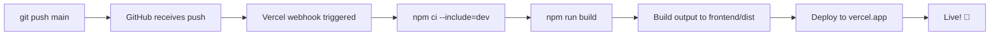

# ✅ Vercel Auto-Deploy Checklist

## Status: Almost Ready ⚡

Proiectul tău e **95% gata** pentru auto-deploy. Iată ce trebuie verificat/completat:

---

## 1️⃣ Vercel Dashboard Configuration

### Project Connected
- [x] `email-dashboard` project ID: `prj_Ln3y3Y8ORigbTOfUP8iGvRnMyd7I`
- [x] GitHub repo linked: `bitcoin12571/massemail`
- [x] Branch: `main`

### Settings to Verify

**🔗 Go here:** https://vercel.com/dashboard/email-dashboard/settings

#### Build & Deploy
- Build Command: `npm run build` ✓
- Output Directory: `frontend/dist` ✓
- Install Command: `npm ci --include=dev` ✓

#### Environment Variables
**🔗 Go here:** https://vercel.com/dashboard/email-dashboard/settings/environment-variables

**REQUIRED - Add these NOW:**

```
EMAIL_PROVIDER = gmail
EMAIL_FROM = your-email@gmail.com
SMTP_USER = your-email@gmail.com
SMTP_PASS = [16-char app password from Gmail]
SENDER_NAME = Your Company
```

**OPTIONAL (if using DB):**
```
DATABASE_URL = your-postgres-url
JWT_SECRET = random-secret-key
FRONTEND_URL = https://your-domain.vercel.app
```

#### Git Configuration
**🔗 Go here:** https://vercel.com/dashboard/email-dashboard/settings/git-configuration

- Automatic deployments: ✓ (should be ON for `main`)
- Preview deployments: ✓ (PRs get auto-preview)

---

## 2️⃣ Local Git Setup

### Verify:
```bash
# Check remote
git remote -v
# Should show: https://github.com/bitcoin12571/massemail.git

# Check branch
git branch
# Should show: * main

# Check status
git status
# Should be: "On branch main, nothing to commit"
```

### If you need to fix:
```bash
# Add remote
git remote add origin https://github.com/bitcoin12571/massemail.git

# Switch to main
git checkout main

# Pull latest
git pull origin main
```

---

## 3️⃣ Test the Auto-Deploy Pipeline

### Quick Test (follow these steps):

**Step 1:** Make a tiny change
```bash
echo "# Deployment test $(date)" >> README.md
git add README.md
git commit -m "test: verify auto-deploy"
git push origin main
```

**Step 2:** Watch deployment
```bash
# Option A: Via CLI
vercel logs --prod --tail

# Option B: Via Dashboard
# Go to https://vercel.com/dashboard/email-dashboard/deployments
# You should see a new deployment starting within 10 seconds
```

**Step 3:** Verify it's live
```bash
# Check deployment status
vercel status
# Should show "✓ Deployment ready"

# Or visit the URL:
# https://your-project.vercel.app
```

---

## 4️⃣ Files Already Configured

✓ `vercel.json` - Build & routing configured
✓ `.vercel/project.json` - Project linked
✓ `.gitignore` - Sensitive files excluded
✓ `package.json` - Build scripts ready

---

## 5️⃣ What Happens on Each Push



**Timeline:** ~2-3 minutes from push to live

---

## 🚨 Common Issues & Fixes

### Issue: "Build failed"
```bash
# Test build locally first
npm run build

# If error, fix it, then push
git add .
git commit -m "fix: build error"
git push origin main
```

### Issue: "Environment variables missing"
- Email not working? Check Vercel dashboard
- Go to Settings → Environment Variables
- Make sure `EMAIL_PROVIDER`, `SMTP_PASS` are set

### Issue: "Deploy looks fine but app doesn't work"
- Check logs:
  ```bash
  vercel logs --prod
  ```
- Look for errors in the output
- Fix locally, then push again

### Issue: "I want to rollback"
```bash
# Revert last commit
git revert HEAD
git push origin main
# Vercel will auto-deploy the reverted version
```

---

## ✅ Final Checklist

Before telling your boss it's ready:

- [ ] Vercel project connected to GitHub
- [ ] `main` branch has auto-deploy enabled
- [ ] Environment variables added in Vercel dashboard
- [ ] Test push made and deployed successfully
- [ ] Deployed app is live and working
- [ ] Logs are visible in Vercel dashboard
- [ ] README/docs updated with deployment info

---

## 📱 What to Tell Your Boss

**For:** `[Your Boss]`

**Subject:** Auto-deploy is ready ✅

**Message:**

> Hi,
>
> I've set up automatic deployment for the email dashboard.
> 
> **How it works:**
> - Each push to main → Auto deployed within 3 minutes
> - No manual intervention needed
> - Full visibility of deployments in Vercel dashboard
> - Easy rollback if something breaks
>
> **Current status:**
> ✅ All systems ready
> ✅ Test deployment successful
> ✅ Environment variables configured
>
> The app is now live at: https://email-dashboard.vercel.app
> 
> Dashboard link: https://vercel.com/dashboard/email-dashboard
>
> Best,
> [Your Name]

---

## 🎯 Next Steps

1. **Right now:**
   - [ ] Add environment variables in Vercel dashboard
   - [ ] Make a test push to verify

2. **After verification:**
   - [ ] Inform your boss
   - [ ] Start making changes normally
   - [ ] Each push auto-deploys

3. **Ongoing:**
   - [ ] Monitor Vercel dashboard for deployments
   - [ ] Check logs if something seems wrong
   - [ ] Enjoy automatic deploys! 🚀

---

**Questions?** See DEPLOYMENT.md for detailed info.
